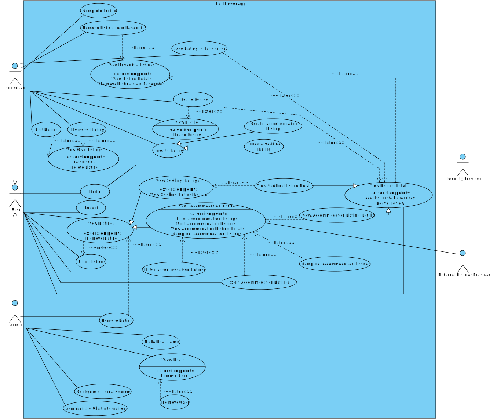
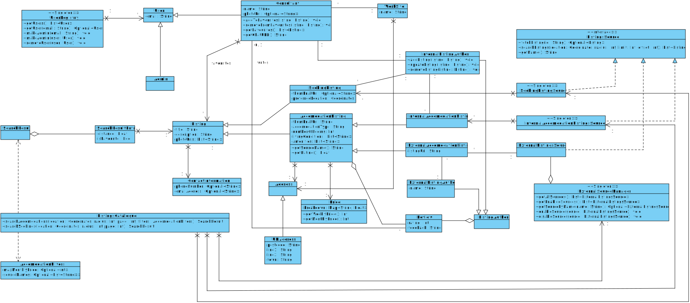

# Flat Finder Application

[Full Requirements](docs/requirements/requirements.md)

[Acceptance tests document](docs/prototype/acceptance-tests.md)

## UML Diagrams

### Use Case Diagram

### Class Diagram

## Contributing

### Semantic branch names

*Note: angle brackets `<>` denote placeholders*

Branch names should follow the following naming convention:

`<type>/<issue-number>-<subject>`

where `type` is to be chosen from the following:

|type|use case|
|-|-|
|`feature`|new feature for the end user (i.e. not a new feature for build script)|
|`fix`|bug fix for the end user (i.e. not a fix to a build script)|
|`build`|adjustment of build tools or external dependencies|
|`chore`|generic maintenance (i.e. no product functionality change)|
|`ci`|modification of Continuous Integration (CI) configurations/scripts|
|`docs`|changes to the documentation|
|`infra`|changes to infrastructure as code|
|`perf`|source code adjustment that improves performance|
|`refactor`|refactoring product code (neither fixes a bug nor adds a feature)|
|`revert`|undo previous commits|
|`style`|code formatting or code style adjustment (i.e. no product functionality change)|
|`test`|implementation of missing or adjustment of existing test (i.e. no product functionality change)|

The `issue-number` should be included if applicable. The `subject` is a very short description of the planned changes.

### Commit messages

The first line of commit messages should be a brief description of your changes
and conform to the following guidelines:

- Imperative, present tense (i.e. »change« instead of »changed« or »changes«)
- Short description (~50 characters is the soft limit)
- Skip the full stop (.)

(adapted from [Semantic branch names and commit messages in Git](https://dev-tips.com/git/semantic-branch-names-and-commit-messages-in-git) <small>[CC-BY-SA 4.0](https://creativecommons.org/licenses/by-sa/4.0/)</small>)
